# Neural Network Proteomic Prediction Model!

**Summary:** This project is the start of model building for a study that 
uses protemoics to predict curve severity in patients with scoliosis.  

The objective is to take information gained about cellular functions, 
disease states, and biological pathways obtained from analyses of 
7,500 proteins to estimate a patient's Max Cobb angle - the largest point of 
spinal curvature measured in degrees on an X-ray. I trained multiple 
neural networks to predict the target variable, then used ensemble learning to 
train a stacked linear regression on the network outputs.   

## Table of Contents:
1. [Python files](#python-files)  
2. [Predictors and Targets](#predictors-and-targets)  
3. [Modeling approach](#modeling-approach)  
    - [Data processing](#data-processing)  
    - [Baseline model](#baseline-model)  
    - [Initial model building](#initial-model-building)  
    - [Hyperparameter search](#hyperparameter-search)
    - [Model selection](#model-selection)
    - [Ensemble approaches](#ensemble-approaches)
4. [Final summary and next steps](#final-summary-and-next-steps)

## Python files 
1. data_processing.py 
    - Simple data processing. The original dataset was delivered as separate  
    training and testing sets. I combined both sets together and instead 
    split into training/validation via K-fold cross-validation during model 
    building. 
        - The original datasets were 66 training examples and 10 testing 
        examples. With the small sample size relative to the number of 
        features, I chose to combine into one larger set to use in both 
        training and validation.  
    -  Because of this decision, we do not have a true hold out  
    set for testing. 
        - Generalizability to unseen data should be validated in the future.
2. data_processing_pt2.py
    - Drop a few protiens with high missingness
    - Encode patient biological sex as categorical 
    - Use KNN to impute missing values
3. baseline_regression.py
    - I used a linear regression with L2 (Ridge) regularization as the 
    baseline model for comparison. 
4. ProteomicsModel.py
    - Initial model building, exploring network depth and width, 
    parameters, etc. The objective here is to see what parameters 
    seem to fit well with my data and (most important in this project) 
    the small sample size. 
    - Also checking gradients and exploring gradient clipping.
5. ProteomicsModel_hyperparams.py
    - A hard-coded version of grid search for hyperparameter 
    combinations. 
    - ~970 combinations in total, with cross-validation and 
    train vs validation plots for each parameter combo. 
6. Model_selection.py
    - Visualizing and selecting the hyperparameters with the 
    lowest training and validation loss. Also considering training and 
    validation loss standard deviation across cross-validation folds. 
    The primary objective is to identify hyperparameter combinations that 
    minimize training and validation loss, but have low variance in loss 
    across folds.
    - Identify the top 10 models for use in ensemble learning.
7. ensemble_options.py
    - Option 1: Take the mean of the 10 predictions. 
    - Option 2: Take the weighted mean of the 10 predictions. 
    Weighting determined by model validation loss.
    - Option 3: Train a regression on the 10 predictions. 

## Predictors and Targets

The dataset is >7500 proteins from patients with scoliosis. 
The dataset was quantile normalized and covariates of age and 
ethnicity were regressed out of the predictors ahead of time 
(i.e., before I began with additional data processing).  

**Figure 1.** Correlation matrix represented as a heat map for 
the predictor variables.  
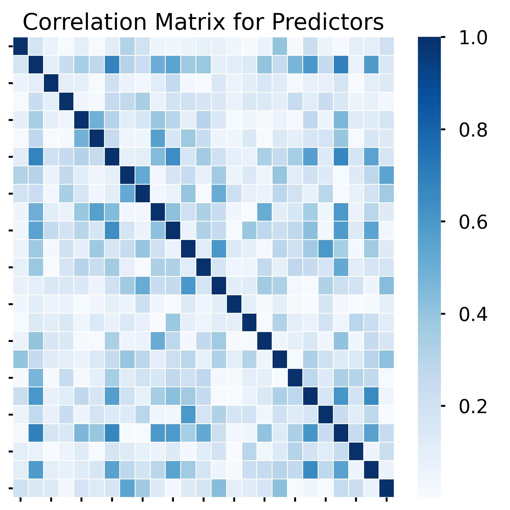
<br>

The target variable is ```max_curve``` - the maximum Cobb angle of 
the spine in this set of patients with scoliosis. It is a 
continuous/regression problem.  

**Figure 2.** Kernel density plots showing the distribution 
of the target variable: max curve angle.  
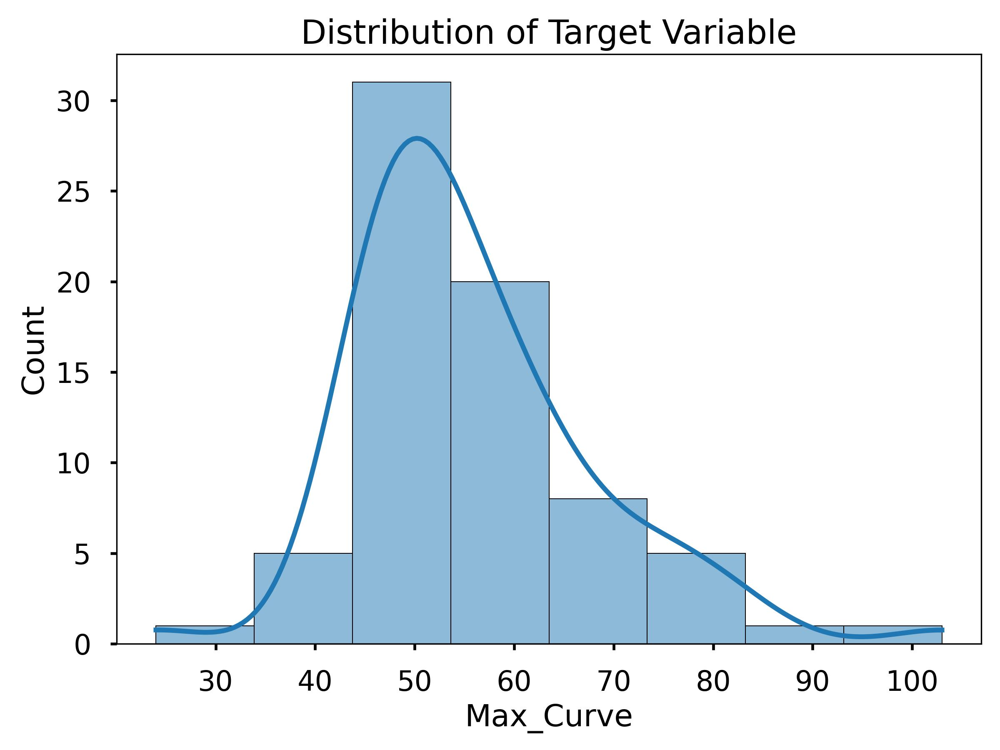
<br>

## Modeling approach

The loss function throughout is Mean Squared Error (MSE).  

### Data processing

The data I recieved were pre-separated into a training 
and validation splits. The training sample was 66 subjects 
and the validation set was 10 subjects. Given the small sample 
size, I elected to combine the pre-separated datasets and use 
cross-validation to iterate through train/val splits, rather than 
maintain one single train/val split.  

I droped 4 subjects with a high degree of missing data. This left 
us with **n=72** subjects to use in training and validation.  

KNN was used to impute missing values for the proteomic features. 
Of the 7,568 features, only 308 had any missing data. The missing 
data were contained only to the set of 10 subjects who were 
originally included in the validation set. KNN with k=5 was used 
to impute the missing data.  

### Baseline model

My preference is to use a true hold-out test sample to evaluate model 
performance in a set of subjects not seen during model training, evaluation, 
or hyperparameter selection. However, with the sample currently at 72 
subjects, and with my pre-selected decision to use neural networks for model 
building (learning more about NN, so this is a decision I am forcing on the 
data, which I discuss as a limitation in the 'next steps' section below), 
all I could afford to do is create train and validation splits 
through k-fold cross-validation. The value for K was set at k=6, 
and that value is used continuously throughout the project, 
including when fitting and evaluating the neural networks later on.  

A linear regression with L2 (Ridge) regularization was fit. 
Even with regularization, the ridge regression overfit to the data 
significantly. Extremely high alpha values - the strength of the 
regularization - were needed for the validation loss to even remotely 
approach the training loss.  

**Figure 3.** Training and validation loss during 6-fold 
cross-validation for a Ridge Regression predicting our 
target variable.  
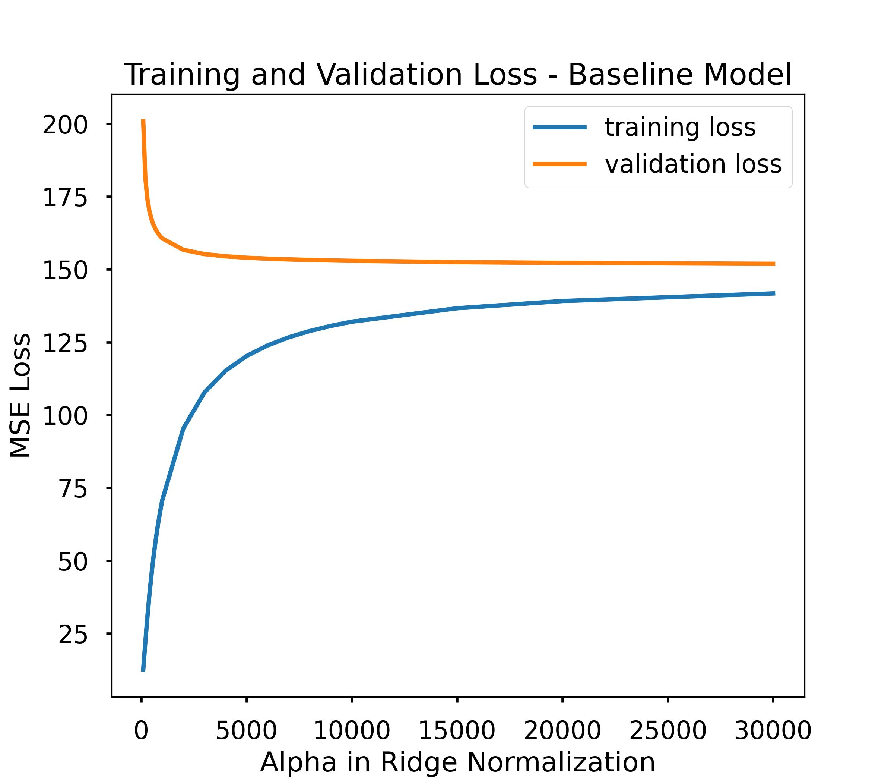
<br>

**Baseline Performance:** In 6-fold cross-validation, the baseline 
ridge regression model had a tendency to overfit to the training data, 
as evidenced by a higher mean validation loss across CV folds compared to 
training loss, and a high standard deviation of loss across CV folds. 
Results are reported as mean (SD) of MSE across all 6 folds of CV:   

|                      | Training Loss | Validation Loss |
| -------------------- | :-----------: | :-------------: |
| Baseline Regression  | 45.9 (7.71)   | 167.1 (86.79)   |
<br>

**Figure 4.** Actual and predicted values for the baseline ridge 
regression model. These are the predicted values for each of the 6 
validation sets in the 6-fold cross-validation. The grey dashed line 
represents a perfect predictor.  
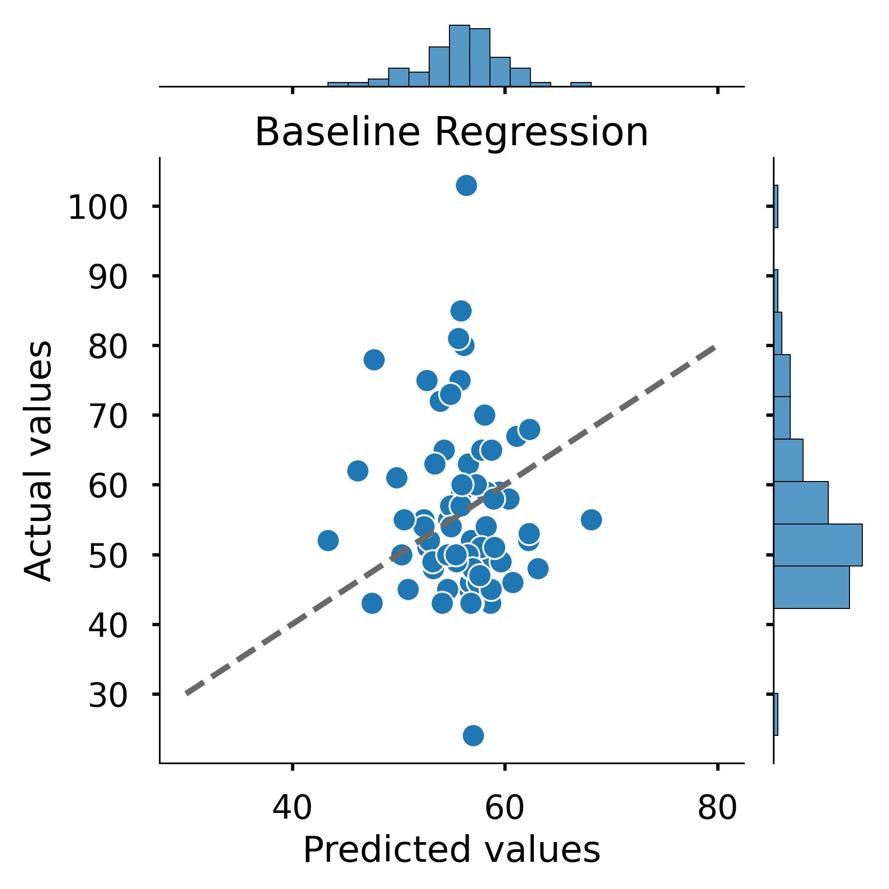
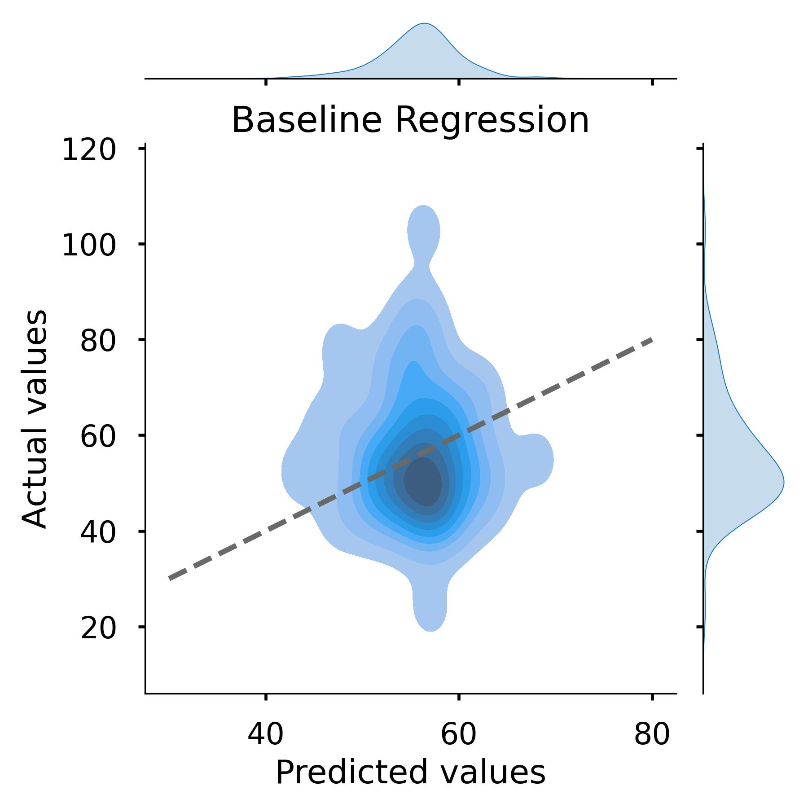
<br>

### Initial model building

I forced a neural network (multi-layer perceptron) for this 
task. In the 'next steps' section below, I discuss finding a 
model that fits the data rather than forcing the data to fit 
a model. But, for this example, I am learning more about PyTorch, 
so NN is what I used regardless of fit.  

The ProteomicModel.py file contains some initial model building. 
I evaluated model depth and width, activation functions, 
dropout, gradient clipping, lr's, optimizers, etc.  

What I found is that the small sample size still works well 
with a shallow network. When I include just 4 layers that work 
down from 7568 > 2500 > 1000 > 100 > 1, the model tends to 
train just fine. This is the set-up I used to search hyperparameters.  

The initial network exploration ended with a MSE loss of 295.6. Though this 
is significantly larger than the mean validation MSE loss in the baseline 
regression model, the two values are not comparable right now because the 
baseline regression was trained and evaluated in different cross-validation 
splits, with varying sample sizes. Whereas my exploratory model here was 
trained and evaluated in the full dataset at once (without CV). Below are 
the loss plots over epochs and predicted vs actual target values for this 
initial exploratory model.  

**Figure 5.** MSE loss over epochs for the initial neural 
network. Also shown are the predicted values vs actual target 
values for the model.  
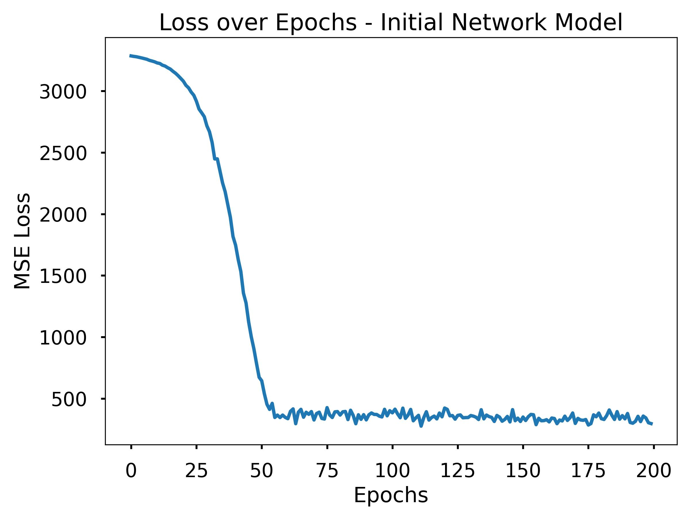

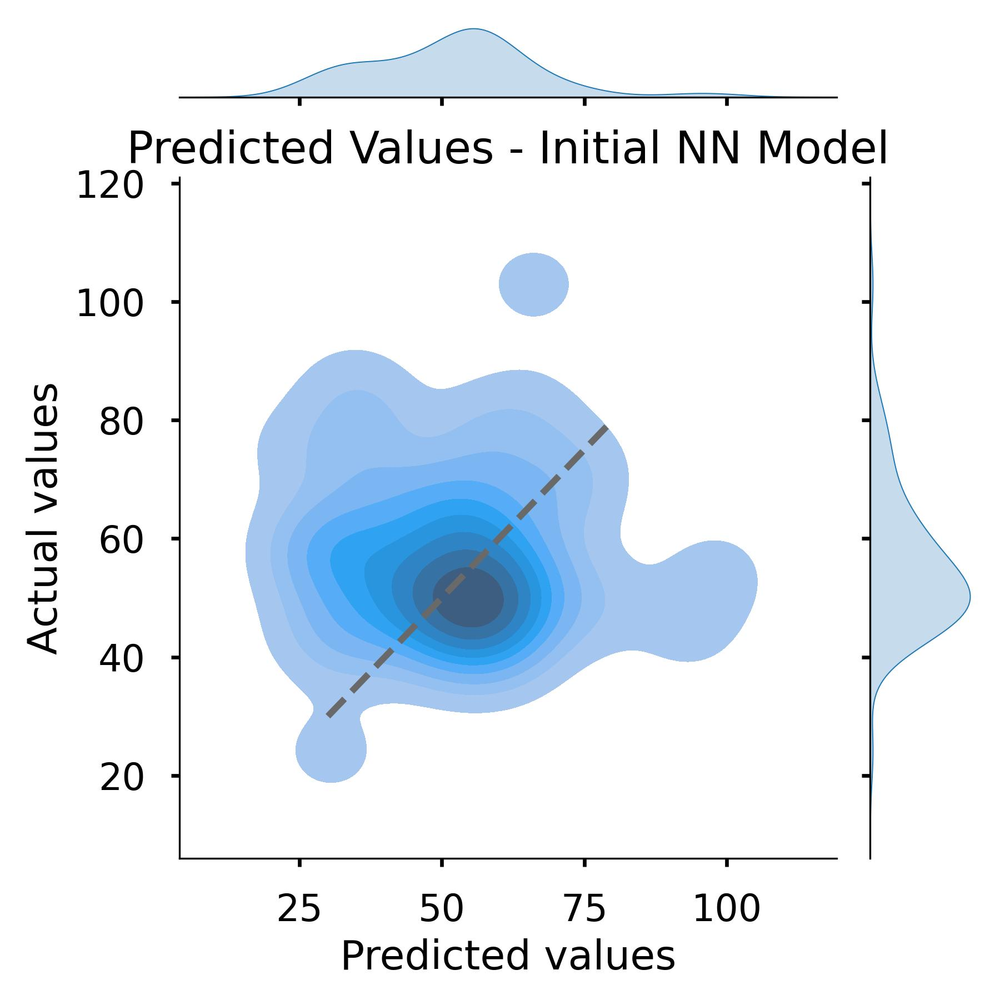
<br>

### Hyperparameter search

I used grid searching to find hyperparameters. This project taught me 
that I should probably partition the search by first identifying a good 
optimizer and learning rate, then start exploring additional components 
of dropout, momentum, etc. later on. I searched an entire grid of values 
for: batch size, learning rate, momentum optmizer, max_norm in gradient 
clipping, and dropout.  

**Cross-Validation:**  
I used 6-fold cross-validation, training and evaluating 6 
models for each combination of hyperparameter values. I then 
averaged the training and validation loss across all folds of the 
data.  

**Flexible Epochs:**  
The model was set to train for 300 epochs. This was based on an approximate 
number of epochs required to reach convergence in exploratory model 
building. However, because I used different batch sizes in the grid 
search - batch sizes of 6, 20, and 60 (full batch) were attempted - the 
actual number of weight updates differed between models with non-matching 
batch sizes, even if both were trained for the same number of epochs. 
To allow models with larger batch sizes the chance to reach convergence, I 
used a flexible epoch training value. A batch size of 60 saw the maximum 
number of epochs increased by a factor of 10 (i.e., from 300 to 3000) 
to account for differing rates of weight updates. A batch size of 20 saw 
the number of training epochs similarly increased by a factor of ~3.33, 
and a batch size of of 6 had no increase in the number of epochs ran. This 
process aligned the training epochs for different batch sizes, ensuring the 
same number of weight updates were attempted regardless of batch size.  

**Early stopping:**  
I also included an early stopping criteria in the model training. 
If validation loss did not increase by a minimum ammount (delta) 
over a number of consecutive training epochs (patience), then the 
training loop was terminated. The pre-set delta was 5 points, 
so the model had to improve validation loss by 5 points to reset 
the patience counter. If the patience counter was not reset after 
15 epochs (i.e., after 15 epochs, the model had not improved 
validation loss by 5 points or more), then the training loop was 
terminated. The patience value of 15 epochs was also adjusted based 
on batch size, using the same process as outlined above.  

Training and validation loss plots over epochs were maintained for 
each hyperparameter combination. Rather than save a plot for every 
model in CV (6 models per hyperparam combination), I just saved the 
model loss plots for the last CV fold.  

**Figure 6.** Training and validation loss plots for two examples 
of models in my grid search with different hyperparameter combinations. 
The first is a model trained for the full 300 epochs that did not 
reach convergence. The second had more aggressive gradient clipping 
and met early stopping criteria after ~75 epochs of training.  
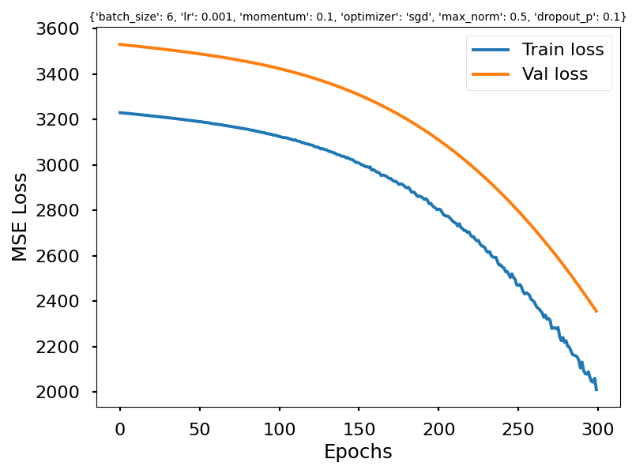
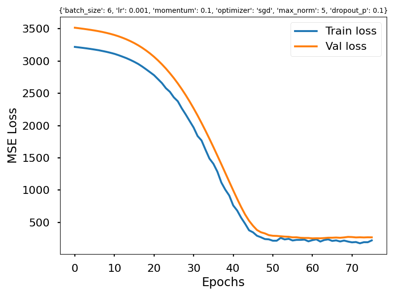

### Model selection

I used mean training and validation MSE Loss across CV folds 
to determine which models were performing the best. The top 
10 performing models would be included in later ensemble 
learning tasks. The decision to keep 10 models was arbitrary. 
A next step in this project might be evaluating different 
combinations of models to determine which are best in ensemble 
learning tasks.  

**Figure 7.** The mean training and validation losses for each 
model across the 6-folds in cross-validation. Most models have 
training and validation losses below 1,000. A few models failed 
to identify patterns in the data and thus have high loss. In the 
next plot, I filter out those poor performing models.  
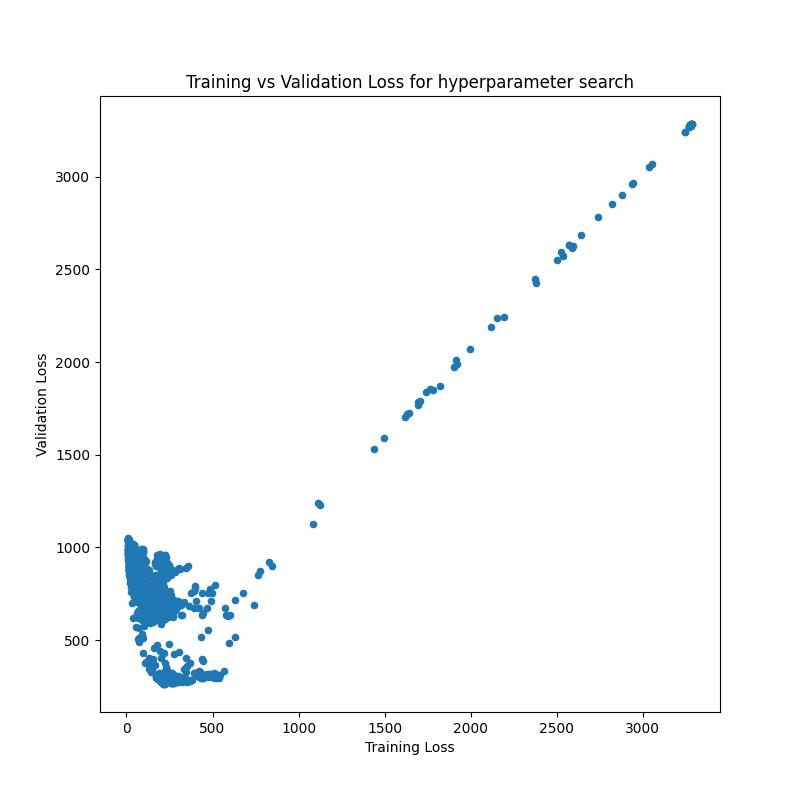
<br>

**Figure 8.** The same mean training and validation losses for 
models, but I filtered the list to only include those with a 
validation loss less than 1,000. We are again seeing a pattern 
where a majority of models are overfitting to the training data 
and failing to generalize to the validation sets (cluster 
of points in the upper left of the plot). But a handful of models 
are performing well in both training and validation sets 
(smaller cluster of models in the bottom center of the plot). 
Those models might be good candidates for ensemble learning.  
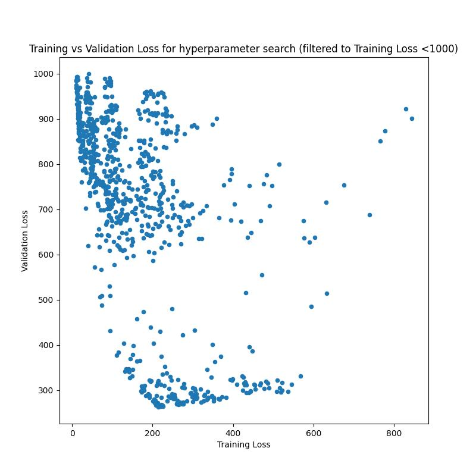
<br>

**Figure 9.** If we filter down even further to just models with 
a training *and* validation loss of below 300, then we can see 
a handful of networks that are performing well in both sets.  

<br>

I selected the best 10 models to use in my ensemble learning. In 
the future, I might explore different model types to include in 
the ensemble, but for this initial start I just chose the best 
10.  

To identify the best 10, I evaluated the mean training 
and validation losses across CV folds. I also considered the 
standard deviation of the training and validation losses across 
folds. An ideal model would have low but comparable losses in 
training and validation (i.e., not grossly overfitting to the 
training data), and would have a low standard deviation for 
the loss in the validation set (i.e., relatively stable 
performance across validation splits).  

**Figure 10.** Training and validation loss for each model 
being considered for ensemble learning. The mean training and 
validation losses are plotted on the X and Y axes, respectively. 
The size of the dot represents the SD for training loss, and the 
color of the dot represents the SD for validation loss. I am 
looking for dots that are smaller (lower training SD), darker 
(lower validation SD), and closer to the bottom left corner of 
the plot.  
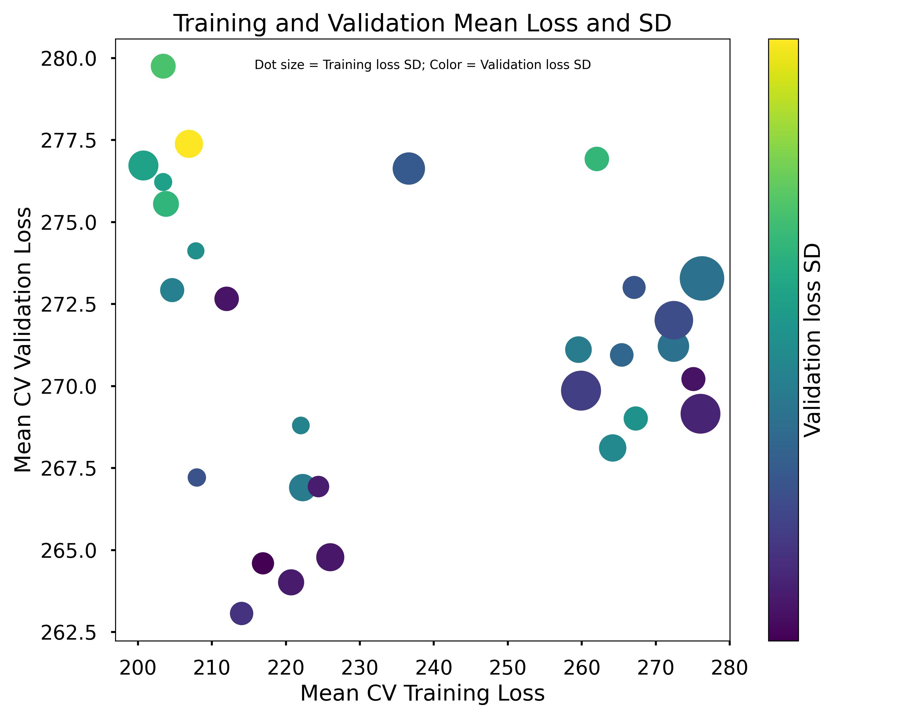
<br>

Based on these criteria, I selected 10 models to use in ensemble 
learning. Below are training and loss plots for all 10 models 
selected:  
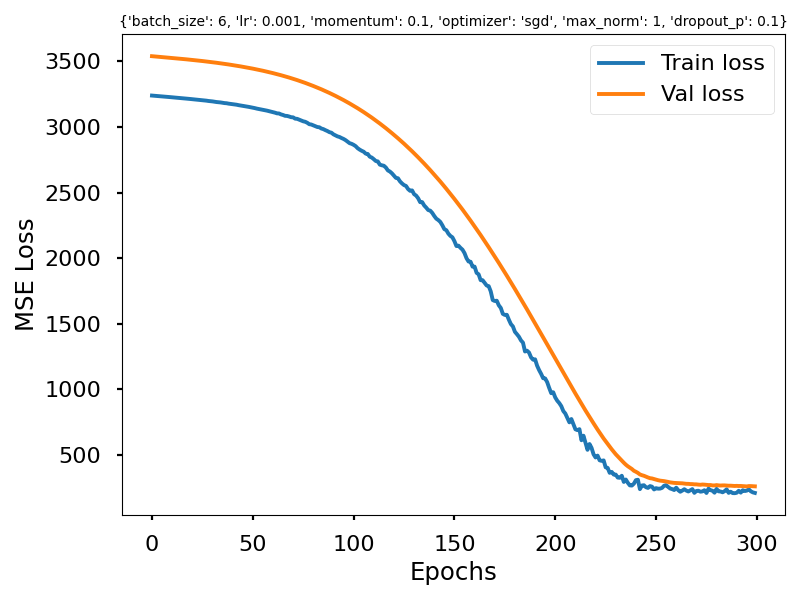
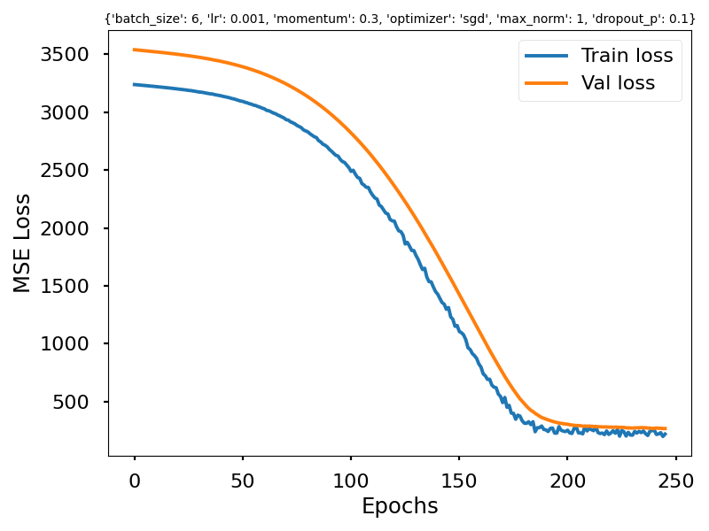
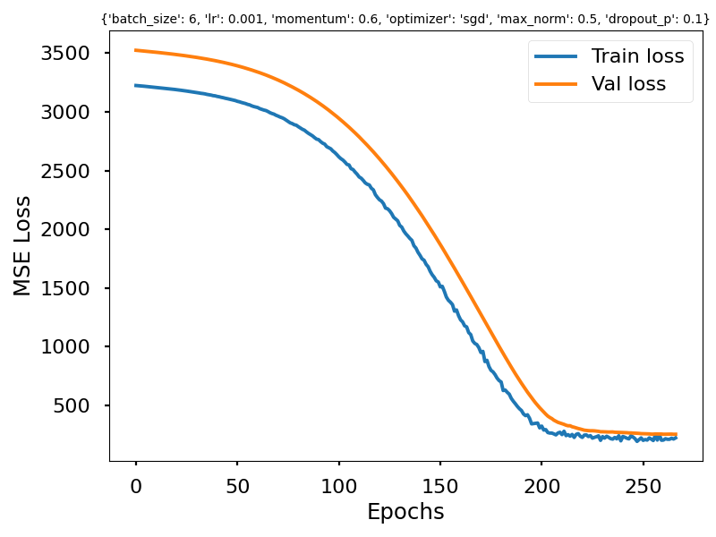
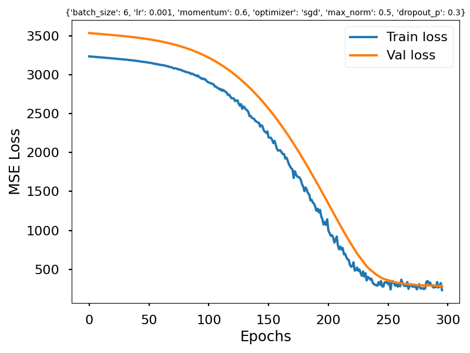

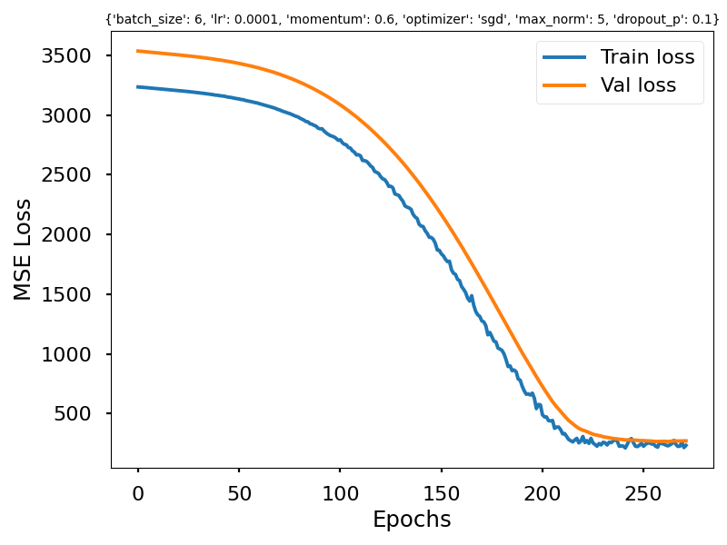
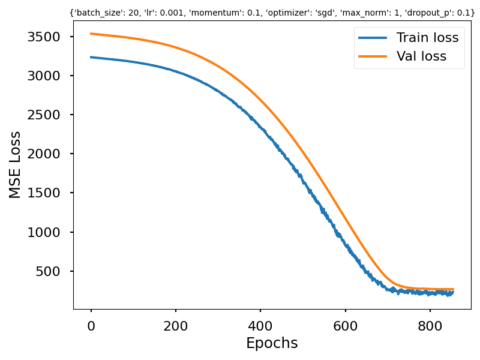
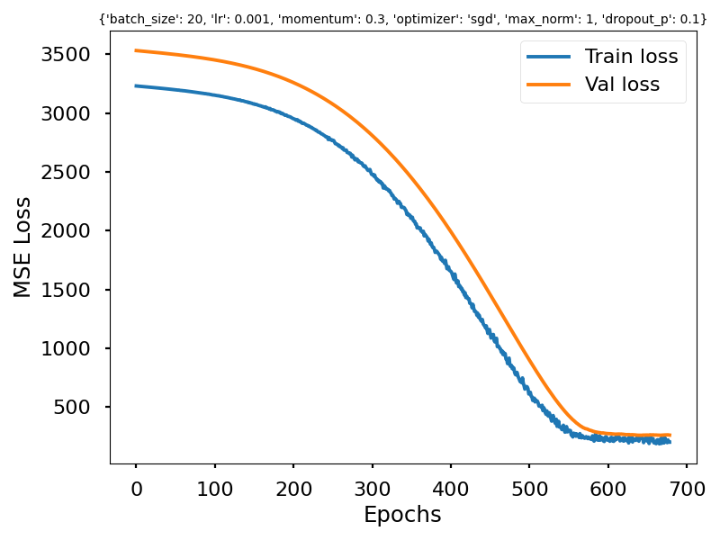
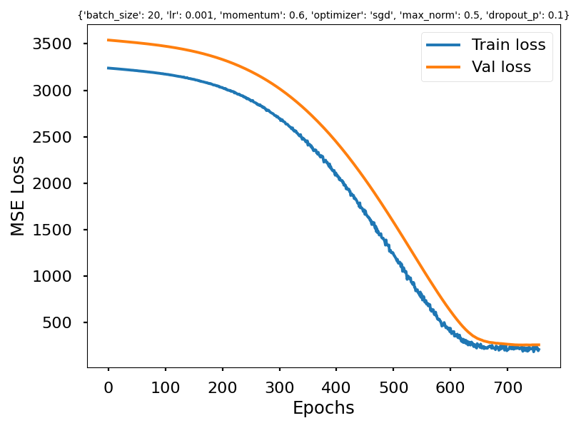
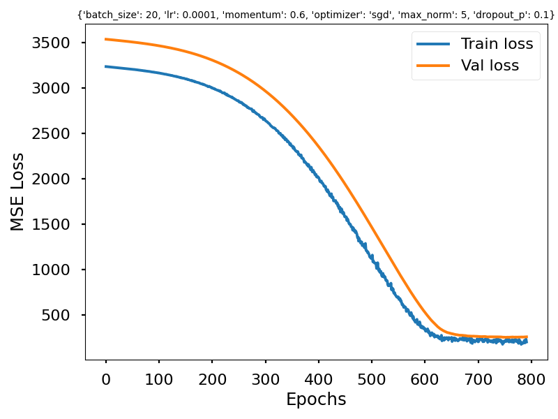
<br>

### Ensemble approaches

In preperation for the ensemble learning, I re-trained each of the 
selected models on the entire dataset. Because early stopping was 
already used during hyperparameter searching, I just repeated the 
same number of training epochs as were previously used during the 
grid search. Model loss was as follows:  

|           | MSE Loss (full dataset) |
| --------- | :---------------------: |
| Model 112 | 263.5                   |
| Model 149 | 257.1                   |
| Model 180 | 240.9                   |
| Model 181 | 266.7                   |
| Model 184 | 238.8                   |
| Model 296 | 248.4                   |
| Model 436 | 238.7                   |
| Model 472 | 244.7                   |
| Model 504 | 246.6                   |
| Model 620 | 246.2                   |
<br>

During CV, the MSE loss for each of the 10 models was as follows. The 
baseline regression model with L2 regularization is also included for 
quick reference:  

|           | Mean Training Loss (SD) | Mean Validation Loss (SD) |
| --------- | :---------------------: | :-----------------------: |
| Model 112 | 221.0 (32.0)            | 264.0 (134.0)             |
| Model 149 | 275.0 (29.0)            | 270.0 (133.0)             |
| Model 180 | 224.0 (25.0)            | 267.0 (134.0)             |
| Model 181 | 267.0 (29.0)            | 269.0 (138.0)             |
| Model 184 | 212.0 (29.0)            | 273.0 (133.0)             |
| Model 296 | 226.0 (34.0)            | 265.0 (134.0)             |
| Model 436 | 214.0 (28.0)            | 263.0 (134.0)             |
| Model 472 | 222.0 (20.0)            | 269.0 (138.0)             |
| Model 504 | 208.0 (21.0)            | 267.0 (136.0)             |
| Model 620 | 217.0 (26.0)            | 265.0 (133.0)             |
|**Baseline Regression**| 45.9 (7.71) | 167.1 (86.79)             |
<br>

#### Ensemble methods:

I evaluated three approaches to ensemble learning:
1. Mean of predictions
    - The mean of the predicted values from the 10 original models.
2. Weighted mean of predictions
    - The mean of the predicted values from the 10 original models, 
    but weighted such that the contribution of the original models 
    is higher for models with a lower (i.e., better) MSE loss 
    during CV.
3. Stacked regressor
    - Train a linear regression to use the 10 original model 
    outputs as inputs and make a single prediction.

I used cross-validation consistent with the CV used during original 
model building (i.e., K=6) and during evaluation of the baseline 
regressor. MSE Loss was the criteria.  

**Mean and weighted mean of predictions:**  
The mean of prediction ensemble approach took the mean of the 10 original 
model outputs. The weighted mean of predictions used a weighted mean of 
the 10 model outputs. The weights assigned to each model's output were 
based on that model's overall validation loss during 6-fold CV. A model 
with higher validation loss (i.e., worse performing) was down weighted. 
Here is how it works:
1. Assign the weights.
    - Weights are equal to the model's CV validation loss. 
2. Inverse the weights so that higher CV loss returns a lower weight value.
    - We can inverse easily by subtracting each weight value from the 
    maximum of all weight values. Now, the lowest CV validation losses are 
    set to the highest weight values. 
    - I needed to add 1 to the maximum of all weight values. Without this, 
    the model with the actual maximum value (i.e., the worst performing of 
    the 10 models used here) would return a weight of 0. Therefore, it would 
    not be used at all in the weighted mean calculation. The small +1 gives 
    that model a tiny (but non-zero) contribution to the weighted mean.
3. Scale up the weights.
    - Later on I will normalize the weights back down so that they sum 
    to 1, but maintain the same ratios. However, because each of the 10 
    models selected for ensemble learning have comparable validation losses 
    (that is why they were selected for ensemble learning to begin with), 
    the difference in weights between models is very small. 
    - Because of this, the resulting weights will be very comparable to 
    a non-weighted average. If I really want models to contribute differently 
    to the mean calculation, I need to scale up the differences between the 
    weights. 
    - An easy way to do this is take the weight values and square them (or 
    take to any power). Higher weights will now be increased even more, and 
    lower weights will not move as much. I liken this to "streching" the 
    weights out, so that better performing models are rewarded with a 
    larger weight, even if their performance advantage over another model is 
    quite small in the original MSE Loss scale. 
4. Normalize weights so they sum to 1. 
5. Include the weights in the mean calculation. 

Here is an example of how this was implemented:  
```python
# step 1: weights are set to CV validation loss
w = model["CV_validation_loss"]

# step 2: inverse so higher weights = lower loss
w = (w.max() + 1) - w

# step 3: scale up weights
w = w ** 2

# step 4: normalize so they sum to 1 
w = w / w.sum()

# step 5: include weights in mean calculation 
y_pred = (inputs * w).sum()
```  

**Stacked Regressor:**  
The stacked regressor was trained in cross-validation training 
sets and evaluated in validation sets. The regression was trained 
for 4000 epochs, based on some exploration of the number of epochs
needed to reach convergence.  

#### Ensemble performance:

The mean and standard deviation MSE Loss for each ensemble 
approach is included in the table below. Training loss is 
reported for the stacked regressor but not the other 
ensembles, because they did not need to be 'trained'.  

| Ensemble approach:             | Training Loss | Validation Loss |
| ------------------------------ | :-----------: | :-------------: |
| Mean of predictions            | N/A           | 233.6 (111.30)  |
| Weighted mean of predictions   | N/A           | 233.0 (111.42)  |
| Stacked regressor              | 131.2 (13.14) | 174.5 (74.25)   |
|                                |               |                 |
|*Best-performing original model*| 214.0 (28.0)  | 263.0 (134.0)   |
| **Baseline Regression**        | 45.9 (7.71)   | 167.1 (86.79)   |
<br>

The mean and weighted mean of predictions ensemble approaches did improve 
the MSE Loss compared to the best-performing model from the original 10 
selected for ensemble learning. However, these two mean of prediction 
approaches still failed to match the performance of the baseline ridge 
regression.  

The stacked regressor did substantially improve MSE Loss compared to both 
the best-performing model from the original 10 and compared to each of the 
other ensemble approaches. It approached the MSE loss of the baseline 
regression in validation sets, and had a higher loss in the training set 
than the baseline regression. It is possible that the stacked regressor 
is performing better and is likely a better candidate for generalization 
to truely unseen data (i.e., when data leakage is no longer occuring, as is 
happening here) than the baseline regression model. However, further 
investigation with a true hold-out set is required.  

**Figure 11.** A scatter of predicted vs actual target values for 
ensemble predictors. The diagonal grey line represents a perfect 
predictor.  

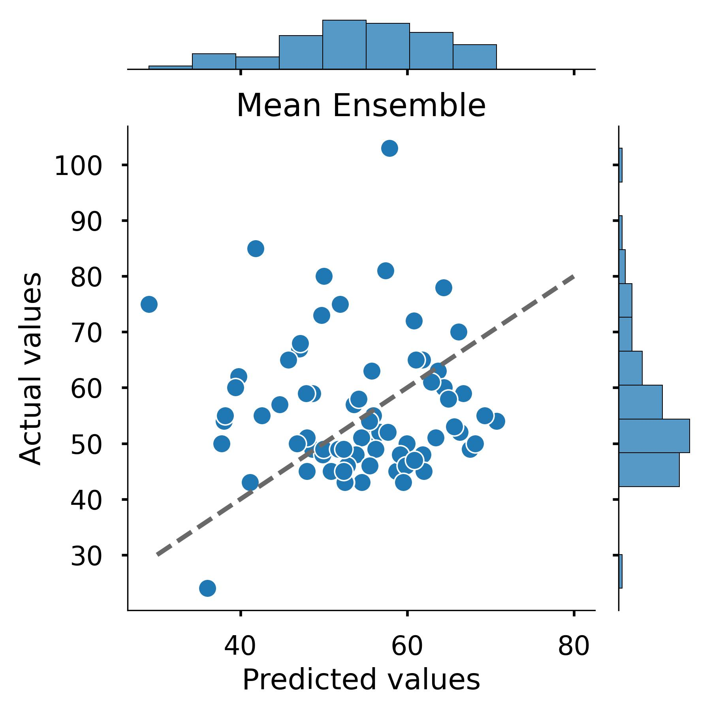
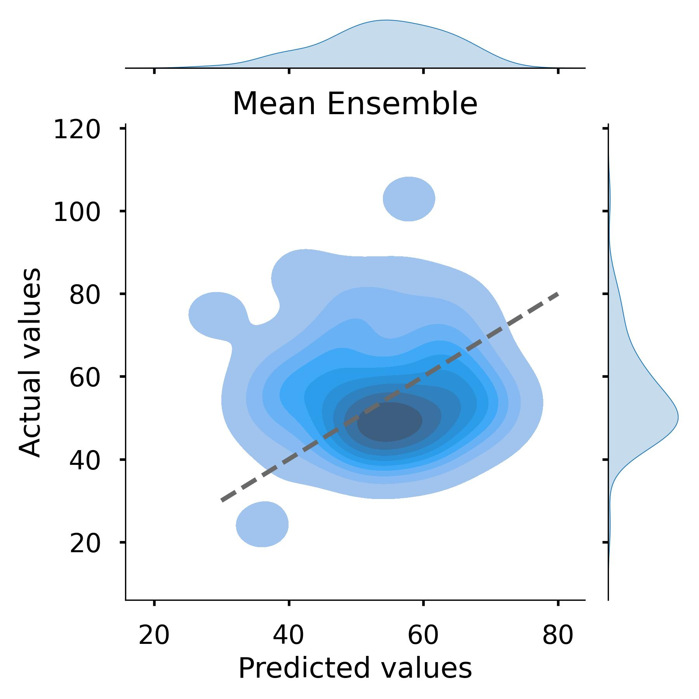
<br>

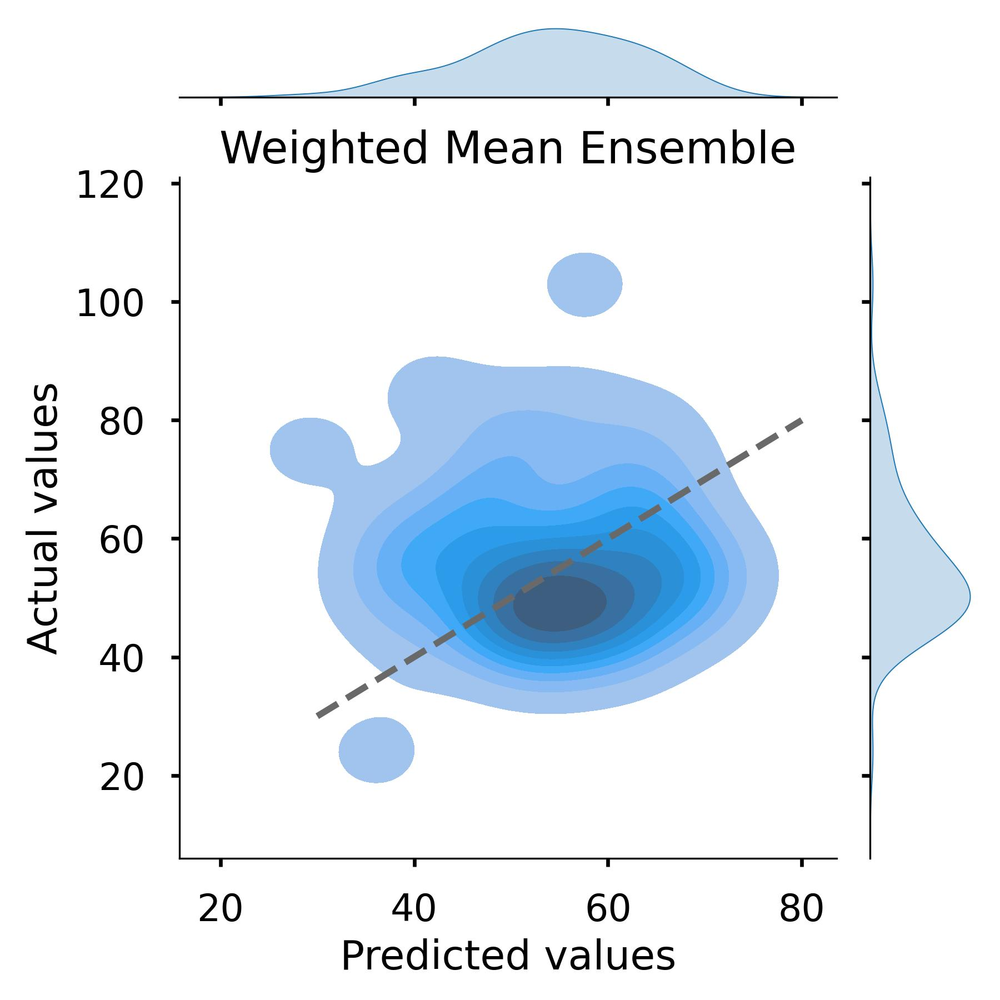
<br>

**Stacked regressor ensemble:**  

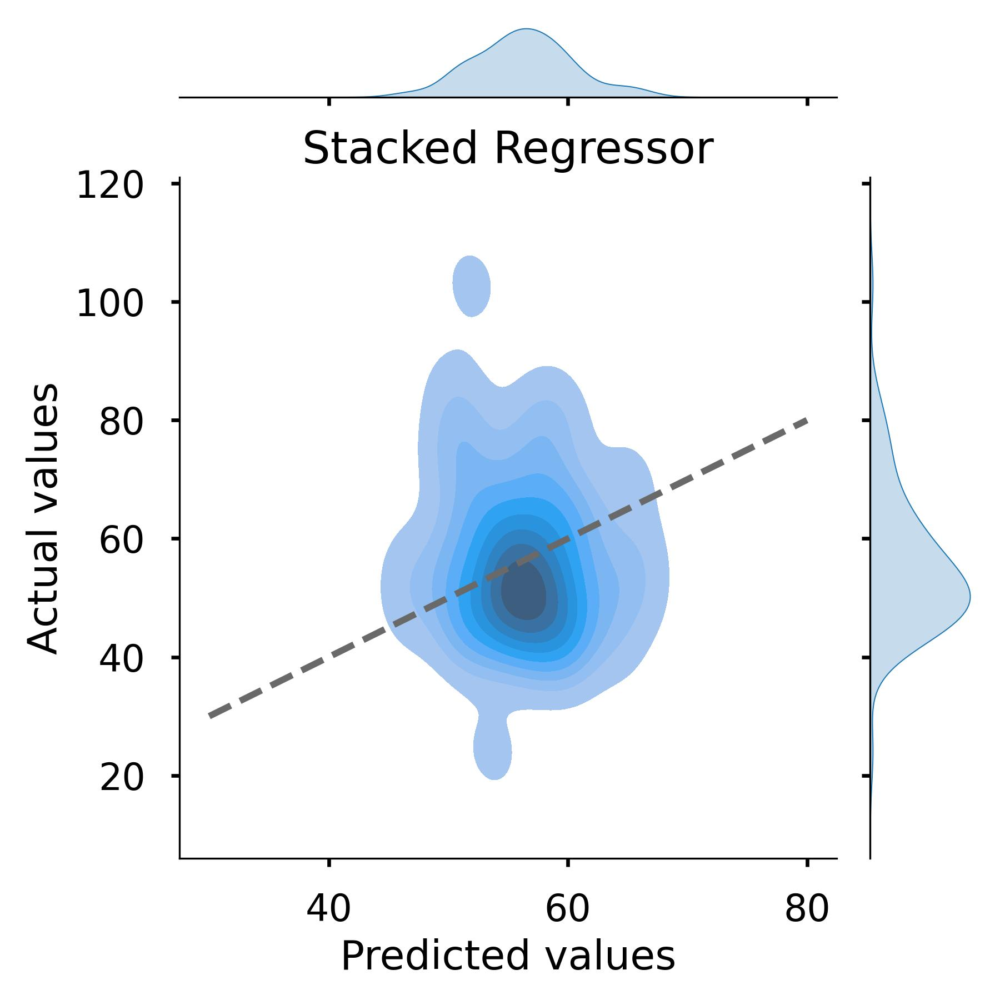

**Revisiting the baseline ridge regression model:**  


## Final summary and next steps

1. The stacked regressor and baseline regression with ridge regularization 
were potential candidates for final prediction models in this dataset.  
    - The ridge regression showed some signs of overfitting. 
    - Both require further exploration in a larger sample size and evaluation 
    in a true hold-out sample.

2. The neural networks individually were poor performers.
    - I likely did not have enough training data to make 
    good use of the NN's ability to identify complex relationships.

3. Ensemble learning with a stacked regressor was a good 
solution to combining the predictions from several networks. 
    - The mean and weighted mean ensembles did not significantly 
    improve prediction performance. 
        - This makes sense. If the individual models are not 
        performing very well, it is unlikely that a simple 
        mean or weighted mean of those predictions will improve 
        our accuracy.

4. Future tasks
    - Increase sample size 
        - Allow more complex model types (i.e., NN) to identify 
        relationships in a larger group of subjects. 
    - Include true hold-out sample
        - So we can get a better idea of how different model types 
        will generalize. 
    - Improve feature engineering
        - 7500+ features in this dataset. Need to find ways to:
            - reduce the number of features 
            - combine features if possible
            - explore correlation/covariance among features
    - Log transform the outcome
        - Reduce influence of outlier datapoints
    - Explore model types for this unique dataset
        - NN may not be the best option, particularly given the 
        small sample size.
